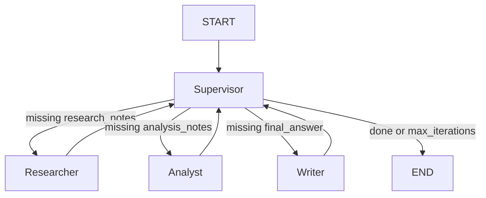

# Design Template

## Problem

Hệ thống cần xử lý các yêu cầu nghiên cứu dài, cần tìm nguồn, phân tích bằng chứng và viết câu trả lời cuối cùng có cấu trúc. Các query benchmark gồm GraphRAG, customer support workflows và production guardrails cho LLM agents.

## Why multi-agent?

Single-agent baseline nhanh và rẻ, nhưng phải làm research, analysis và writing trong một prompt. Multi-agent tách trách nhiệm thành nhiều bước rõ ràng, giúp dễ debug, dễ trace và giảm rủi ro output thiếu grounding.

## Agent roles

| Agent | Responsibility | Input | Output | Failure mode |
|---|---|---|---|---|
| Supervisor | Điều phối workflow bằng rule-based routing | `ResearchState` | Route tiếp theo: `researcher`, `analyst`, `writer`, `done` | Loop nếu thiếu max iteration guard |
| Researcher | Tìm sources bằng Tavily/mock và tóm tắt nguồn | `request.query` | `sources`, `research_notes` | Search lỗi, source yếu, thiếu dữ liệu mới |
| Analyst | Trích xuất key claims, so sánh viewpoints, chỉ ra weak evidence | `research_notes`, `sources` | `analysis_notes` | Phân tích thiếu chiều sâu hoặc bỏ sót mâu thuẫn |
| Writer | Tổng hợp final answer có citations | `research_notes`, `analysis_notes`, `sources` | `final_answer` | Citation format sai hoặc thiếu citation |

## Shared state

| Field | Reason |
|---|---|
| `request` | Lưu query đầu vào và metadata |
| `iteration` | Kiểm soát số vòng chạy để tránh infinite loop |
| `route_history` | Debug thứ tự agent đã chạy |
| `sources` | Lưu documents dùng để grounding |
| `research_notes` | Output của Researcher cho Analyst dùng tiếp |
| `analysis_notes` | Output của Analyst cho Writer dùng tiếp |
| `final_answer` | Câu trả lời cuối cùng |
| `agent_results` | Lưu output từng agent và metadata cost |
| `trace` | Lưu event log cho observability |
| `errors` | Lưu lỗi runtime/fallback |

## Routing policy

Rules:

1. Nếu `iteration >= max_iterations` thì route `done`.
2. Nếu thiếu `research_notes` thì route `researcher`.
3. Nếu thiếu `analysis_notes` thì route `analyst`.
4. Nếu thiếu `final_answer` thì route `writer`.
5. Nếu đủ output thì route `done`.

## Guardrails

- Max iterations: `MAX_ITERATIONS=6`.
- Timeout: `TIMEOUT_SECONDS=60`.
- Retry: `LLMClient` dùng `tenacity` exponential backoff.
- Fallback: `SearchClient` dùng mock sources nếu Tavily fail hoặc thiếu API key.
- Validation: Pydantic schemas kiểm tra state, source, agent result và metrics.

## Benchmark plan

| Query | Metrics | Expected outcome |
|---|---|---|
| Research GraphRAG state-of-the-art and write a 500-word summary | Latency, cost, citation coverage, failure rate | Multi-agent chậm hơn nhưng trace rõ hơn |
| Compare single-agent and multi-agent workflows for customer support | Latency, cost, citation coverage, failure rate | Multi-agent có phân tích cấu trúc hơn |
| Summarize production guardrails for LLM agents | Latency, cost, citation coverage, failure rate | Multi-agent thể hiện rõ research → analysis → write |
