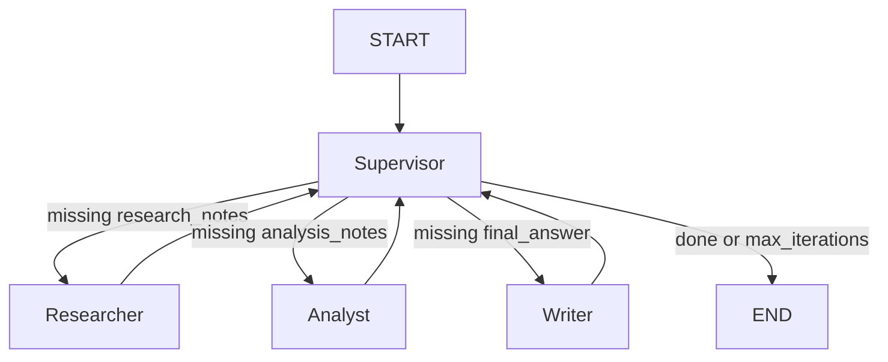

# Multi-Agent Research Lab: Design Architecture

## Problem

Hệ thống cần xử lý các yêu cầu nghiên cứu phức tạp từ người dùng. Mục tiêu không chỉ là trả lời bằng kiến thức sẵn có của LLM, mà còn cần:

- Tìm kiếm thông tin mới nhất từ web.
- Tổng hợp nguồn thành research notes.
- Phân tích, so sánh, phát hiện điểm yếu trong bằng chứng.
- Viết câu trả lời cuối cùng có cấu trúc và có citations.
- Ghi trace, latency, cost và benchmark để so sánh single-agent với multi-agent.

Bài lab này dùng chủ đề mẫu như GraphRAG, customer support workflow và production guardrails cho LLM agents.

## Why multi-agent?

Single-agent baseline gọi thẳng Gemini để trả lời. Cách này nhanh và rẻ hơn, nhưng có các hạn chế:

1. **Thiếu grounding**: Không tự động tìm nguồn web nên dễ thiếu bằng chứng cập nhật.
2. **Dễ hallucinate citations**: Nếu yêu cầu citations, LLM có thể tạo nguồn không kiểm chứng.
3. **Ít phân tách trách nhiệm**: Một prompt phải vừa research, vừa analyze, vừa write.
4. **Khó debug**: Khi output kém, khó biết lỗi nằm ở retrieval, analysis hay writing.
5. **Khó benchmark theo bước**: Không có trace rõ từng giai đoạn.

Multi-agent tách bài toán thành các vai trò nhỏ hơn. Mỗi agent có input/output riêng, dễ kiểm thử và dễ quan sát bằng trace.

## Agent roles

| Agent | Responsibility | Input | Output | Failure mode |
|---|---|---|---|---|
| Supervisor | Điều phối workflow, quyết định agent tiếp theo theo state hiện tại | `ResearchState` | Route: `researcher`, `analyst`, `writer`, `done` | Loop vô hạn nếu thiếu guardrail |
| Researcher | Tìm nguồn bằng Tavily hoặc mock fallback, tóm tắt nội dung nguồn | `request.query` | `sources`, `research_notes` | Search lỗi, nguồn yếu, thiếu dữ liệu mới |
| Analyst | Trích xuất key claims, so sánh viewpoint, chỉ ra weak evidence | `research_notes` | `analysis_notes` | Phân tích thiếu chiều sâu, bỏ sót mâu thuẫn |
| Writer | Tổng hợp câu trả lời cuối cùng có citations | `research_notes`, `analysis_notes`, `sources` | `final_answer` | Citation format sai, answer dài/ngắn hơn yêu cầu |

## Shared state

Workflow dùng `ResearchState` làm single source of truth giữa các agent.

| Field | Purpose |
|---|---|
| `request` | Lưu `ResearchQuery`, gồm query, audience và max_sources |
| `iteration` | Đếm số lần Supervisor route để kiểm soát loop |
| `route_history` | Lưu thứ tự agent đã được gọi |
| `sources` | Danh sách `SourceDocument` từ Tavily/mock |
| `research_notes` | Tóm tắt research do Researcher tạo |
| `analysis_notes` | Phân tích do Analyst tạo |
| `final_answer` | Kết quả cuối cùng do Writer tạo |
| `agent_results` | Output từng agent kèm metadata như cost |
| `trace` | Event log nội bộ: supervisor decision, agent complete |
| `errors` | Lỗi runtime nếu agent/search/LLM gặp vấn đề |

## Routing policy

Supervisor dùng rule-based routing, deterministic và dễ debug.



Routing rules:

1. Nếu `iteration >= max_iterations` → route `done`.
2. Nếu chưa có `research_notes` → route `researcher`.
3. Nếu có `research_notes` nhưng chưa có `analysis_notes` → route `analyst`.
4. Nếu có `analysis_notes` nhưng chưa có `final_answer` → route `writer`.
5. Nếu đã có `final_answer` → route `done`.

Luồng chạy thực tế sau khi benchmark:

```text
researcher -> analyst -> writer -> done
```

## Guardrails

- **Max iterations**: `MAX_ITERATIONS=6`, tránh infinite loop trong LangGraph.
- **Timeout**: `TIMEOUT_SECONDS=60`, giới hạn thời gian gọi LLM/search.
- **Retry**: `LLMClient` dùng `tenacity` với retry và exponential backoff.
- **Fallback**: `SearchClient` dùng Tavily khi có `TAVILY_API_KEY`; nếu lỗi hoặc thiếu key thì fallback về mock sources.
- **Validation**: Pydantic schemas (`ResearchQuery`, `ResearchState`, `AgentResult`, `BenchmarkMetrics`) bắt lỗi type/schema sớm.
- **Traceability**: Mỗi supervisor decision và worker completion được ghi vào `state.trace`; LangSmith tracing bật bằng `LANGCHAIN_TRACING_V2=true`.

## Benchmark plan

### Queries

Benchmark đọc 3 queries từ `configs/lab_default.yaml`:

1. `Research GraphRAG state-of-the-art and write a 500-word summary`
2. `Compare single-agent and multi-agent workflows for customer support`
3. `Summarize production guardrails for LLM agents`

### Metrics

| Metric | Measurement |
|---|---|
| Latency | `perf_counter()` wall-clock time |
| Cost | Sum `AgentResult.metadata["cost"]` |
| Citation coverage | Heuristic count of `[Source X]` in `final_answer` divided by number of sources |
| Failure rate | `1.0` if `state.errors` not empty, else `0.0` |
| Trace completeness | Check `route_history`, `trace`, and LangSmith runs |

### Expected outcome

- Baseline: faster, lower latency, fewer steps, usually no citations.
- Multi-agent: slower, higher cost, but better grounded answer, citations, and clearer reasoning pipeline.

### Current artifacts

- Benchmark script: `scripts/run_benchmark.py`
- Benchmark report: `reports/benchmark_report.md`
- Trace target: LangSmith project `multi-agent-research-lab`

## Implementation summary

- `LLMClient`: Gemini integration with token/cost tracking.
- `SearchClient`: Tavily API with mock fallback.
- `SupervisorAgent`: deterministic routing policy and max iteration guard.
- `ResearcherAgent`: web search + source summarization.
- `AnalystAgent`: claim extraction + weak evidence analysis.
- `WriterAgent`: final answer synthesis with citations.
- `MultiAgentWorkflow`: LangGraph orchestration.
- `run_benchmark`: compares baseline and multi-agent across 3 queries.
